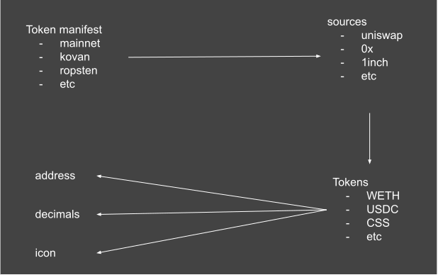

# CIP 2
> Simple and complete tokenlist

manifest>network>dex>token -> `{address, decimals, icon}`  
manifest>network>dex>token>address -> `0xeeeeeeeeeeeeeeeeeeeeeeeeeeeeeeeeeeeeeeee`  
manifest>network>dex>token>decimals -> `18`  
manifest>network>dex>token>icon -> `{color,black,white}`

## Token
### name
type: `String` 
value: `Ether`

### address
type: `String`  
value: `0xeeeeeeeeeeeeeeeeeeeeeeeeeeeeeeeeeeeeeeee`

### decimals
type: `Number` 
value: `18` (Ether) 

### icon
type: `String` 
format: `svg`  
variants: `color,black,white` 
value: `url to icon`
